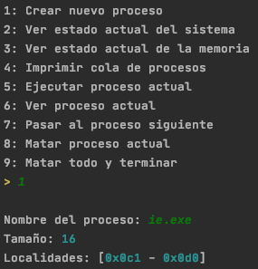
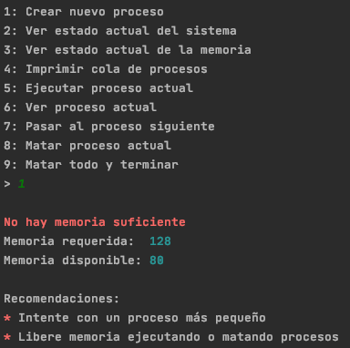
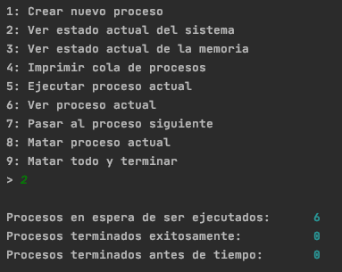
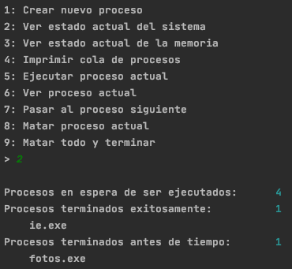
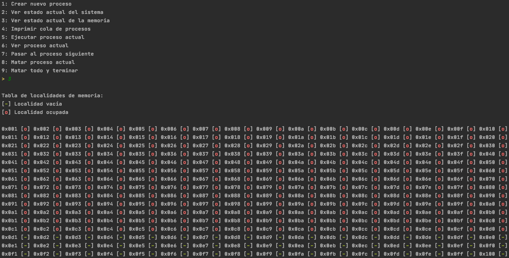
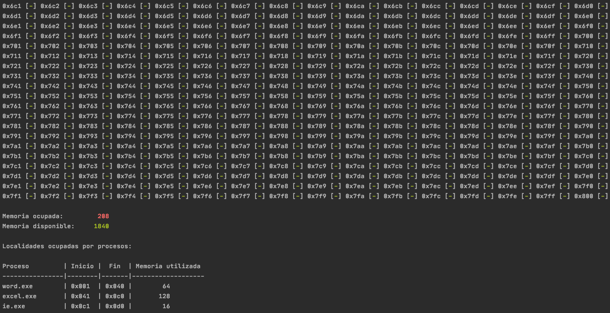
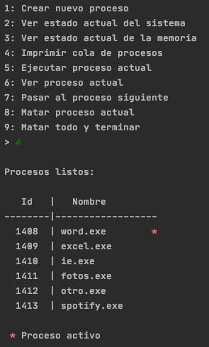
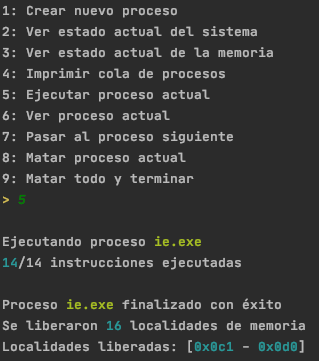
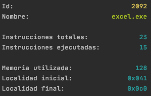
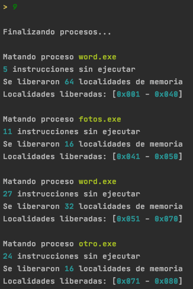

## Simulador de la ejecución de procesos en un sistema operativo

Al crear un proceso nos indica la cantidad de memoria que ocupa así como las localidades de memoria en las que se posiciona.

Si al momento de crear un proceso no hay localidades contiguas de memoria suficientes para crear el proceso entonces se muestra un mensaje con información de la memoria y recomendaciones para continuar con la ejecución del programa. 

También se muestra un mensaje en caso de que no haya la memoria suficiente para crear el proceso, con la información de la memoria disponible y recomendaciones para continuar con el programa.

---

Ejemplo 1 (listas de procesos vacías):

Ejemplo 2 (listas de procesos con elementos):

El estado actual del sistema nos muestra el número de procesos en cola, la lista de procesos terminados de manera exitosa y la lista de procesos eliminados antes de tiempo.

---

El estado actual de la memoria, como su nombre lo indica, nos muestra información acerca de la memoria disponible, imprime la tabla de memoria con las localidades ocupadas y disponibles, así como una tabla con los procesos creados junto con las localidades que cada uno ocupa.

---

La cola de procesos nos muestra el ID y el nombre de los procesos en espera.

---

Ejemplo 1 (Ejecutando instrucciones sin terminar el proceso):

Ejemplo 2 (Ejecutando instrucciones y finalizando proceso):

Se ejecutan 5 instrucciones del proceso, si aún quedan instrucciones el proceso se mueve al final de la cola pero si el numero de instrucciones llega a 0 entonces se liberan las localidades de memoria utilizadas por dicho proceso.

---

Imprime la información del proceso actual, es decir, el primero de la cola.
Muestra el nombre, ID, instrucciones y memoria.

---

Muestra el proceso que se está omitiendo y nos indica qué proceso queda hasta al frente de la cola.

---

Para matar un proceso, se desencola, se imprime su nombre y la información de la memoria que ocupaba.

---

Mata cada proceso mientras imprime la información de cada proceso eliminado.

